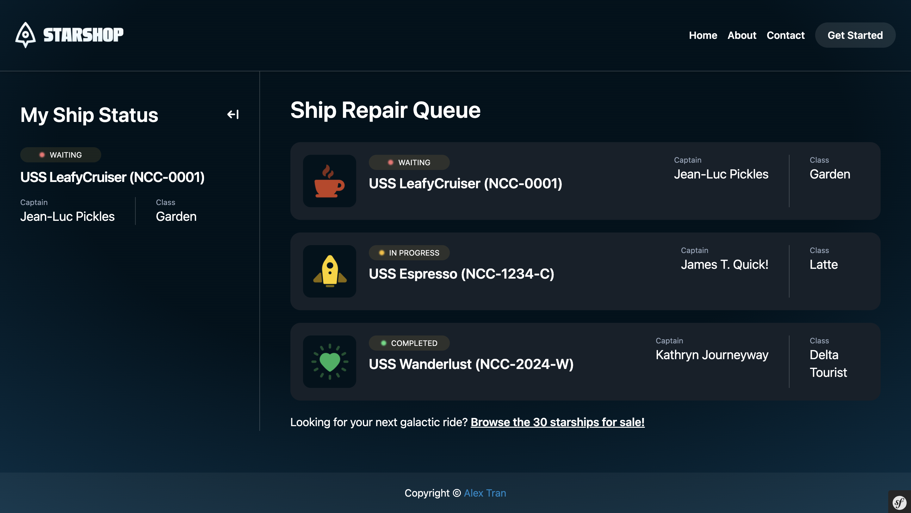
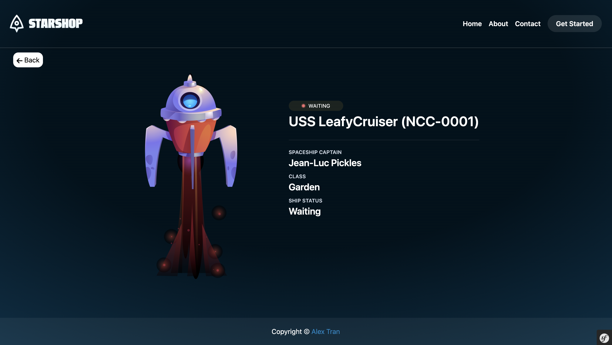

# Starshop

This is a simple e-commerce site for starships and starships repair. The purpose is to pratice symfony 7 and various symfony bundle/libraries.

## Technologies used

Languages:

- PHP
- Twig
- CSS
- Javascript

Libraries and frameworks:

- [Symfony 7](https://symfony.com/7)
- [Twig](https://twig.symfony.com/)
- [Tailwind](https://symfony.com/bundles/TailwindBundle)
- [Stimulus](https://stimulus.hotwired.dev/)
- [Turbo](https://turbo.hotwired.dev/)

## Setup and usage

**Live page [here](http://alextrandev.infinityfreeapp.com/starshop/public/)**

**To host project locally**
- Clone the project: ```git clone https://github.com/alextrandev/starshop.git```
- Change working directory ```cd starshop```
- Install dependencies ```composer install```
- Serve project in local host ```symfony serve```
- Project should run on local port: https://127.0.0.1:8000/

## Screenshot
**Homepage**


**Starship page**


## Sources and acknowledgment

- Cosmic Coding with Symfony 7 Course by [SymfonyCasts](https://symfonycasts.com)
- Course certificate: [Cosmic Coding with Symfony 7](https://symfonycasts.com/certificates/3864F0E5C155)
- Instructor: CEO of SymfonyCasts: [Ryan Weaver](https://github.com/weaverryan)